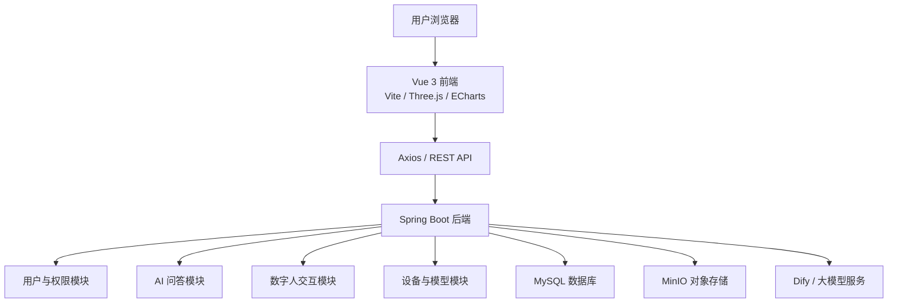

# 智光种植智能口腔平台

智光种植是一个面向口腔种植教学、设备展示、患者科普与智能问答场景的全栈 Web 项目。项目围绕“智能激光口腔种植机器人”的展示与训练需求，整合 3D 可视化、AI 咨询、数字人交互、设备参数管理、用户权限和对象存储等能力，形成一个可演示、可扩展的口腔种植数字化平台。

> 说明：本项目用于教学、竞赛展示和系统原型演示，不构成真实医疗诊断或手术建议。

## 项目背景

传统口腔种植教学和患者沟通通常依赖二维图文、线下讲解和静态设备资料，学习者难以直观看到种植设备、三维口腔结构、术前规划和交互流程之间的关系。对于智能激光种植机器人这类复合型设备，仅展示硬件参数并不足以说明产品价值，还需要一个能承载“看得见、问得清、可管理、可扩展”的数字化系统。

本项目尝试用 Web 技术搭建一个统一入口：

- 用 Three.js 呈现口腔/设备相关 3D 场景，帮助用户理解空间结构和设备工作方式。
- 用 Dify/大模型接口提供口腔种植知识问答、患者咨询模拟和参数辅助解释。
- 用虚拟数字人模块承载更自然的交互式讲解体验。
- 用 Spring Boot 后端提供用户、管理员、设备、模型文件和 AI 接口管理能力。
- 用 MinIO 存储 3D 模型、图片、视频和训练材料，方便后续扩展资源库。

## 核心功能

### 1. 3D 可视化展示

前端基于 Vue 3、Vite 和 Three.js 构建，支持设备/模型的三维展示、场景渲染、页面交互和模型资源加载，适合用于产品演示、教学讲解和结构认知。

### 2. AI 智能问答

后端封装 Dify API 调用，前端提供 AI 对话入口，可用于口腔种植知识问答、设备参数解释、患者咨询模拟和科普内容生成。

### 3. 虚拟数字人交互

项目接入数字人相关配置和前端 SDK，用于模拟“智能讲解员”式交互，让用户以问答方式了解设备能力、操作流程和口腔种植知识。

### 4. 用户与权限管理

后端提供注册、登录、用户信息获取和管理员用户管理能力，使用 JWT 作为登录态凭证，并通过管理员接口区分普通用户与管理用户操作。

### 5. 设备与模型管理

系统包含设备参数、模型上传、模型查询和模型文件访问等接口，便于把口腔设备、种植机器人、3D 模型和展示素材统一管理。

### 6. 文件与资源存储

使用 MinIO 作为对象存储服务，存放图片、视频、3D 模型和训练材料。前端通过代理访问资源，后端负责上传、下载和文件路径管理。

### 7. 科普与展示页面

前端包含知识科普、综合展示、大屏参考、设备商城/展示页面等内容模块，可用于项目路演、课程展示或产品介绍。

## 技术架构



## 技术栈

| 模块 | 技术 |
| --- | --- |
| 前端框架 | Vue 3.5、Vite 8 |
| 3D 渲染 | Three.js |
| 数据可视化 | ECharts |
| HTTP 请求 | Axios |
| 后端框架 | Spring Boot 2.7.18 |
| 后端语言 | Java 17 |
| 数据访问 | MyBatis / MyBatis-Plus |
| 数据库 | MySQL |
| 对象存储 | MinIO |
| 鉴权 | JWT |
| AI 接入 | Dify API、数字人接口 |
| 构建工具 | npm、Maven |

## 目录结构

```text
.
├── 前端源码/                  # Vue/Vite 前端应用
│   ├── public/                # 图片、视频、静态页面和展示素材
│   ├── src/
│   │   ├── components/        # 3D展示、数字人、登录、AI聊天等组件
│   │   ├── services/          # 前端接口封装
│   │   ├── config/            # 媒体与页面配置
│   │   ├── App.vue
│   │   └── main.js
│   ├── package.json
│   └── vite.config.js
├── 后端源码/                  # Spring Boot 后端服务
│   ├── src/main/java/com/laserdentalrobot/
│   │   ├── common/            # 通用返回、异常、工具类
│   │   ├── config/            # CORS、JWT、MinIO、OpenAPI、数字人配置
│   │   ├── controller/        # REST 控制器
│   │   ├── mapper/            # 数据访问层
│   │   ├── pojo/              # DTO、Entity、VO
│   │   └── service/           # 业务服务
│   ├── src/main/resources/
│   │   └── application.yml
│   └── pom.xml
├── .env.example               # 环境变量示例
├── .gitignore
└── README.md
```

## 快速启动

### 1. 准备环境

建议安装：

- Node.js 18+
- JDK 17+
- Maven 3.8+
- MySQL 8+
- MinIO

### 2. 配置环境变量

复制 `.env.example`，按自己的本地服务填写数据库、MinIO、Dify 和数字人配置。

后端敏感配置已经从源码中移除，默认使用本地地址或空值。实际运行时请通过环境变量注入：

```bash
SPRING_DATASOURCE_URL=jdbc:mysql://localhost:3306/laser_robot
SPRING_DATASOURCE_USERNAME=root
SPRING_DATASOURCE_PASSWORD=your_password
DIFY_API_BASE_URL=http://localhost:8280/v1
DIFY_API_KEY_AI=your_dify_ai_key
DIFY_API_KEY_VIRTUAL=your_dify_virtual_key
MINIO_ENDPOINT=http://localhost:9000
MINIO_ACCESS_KEY=minioadmin
MINIO_SECRET_KEY=minioadmin
```

### 3. 启动后端

```bash
cd 后端源码
mvn spring-boot:run
```

默认服务端口见 `后端源码/src/main/resources/application.yml`。

### 4. 启动前端

```bash
cd 前端源码
npm install
npm run dev
```

前端默认开发端口为 `8254`。如果后端或 MinIO 不在本机，可以通过环境变量覆盖代理目标：

```bash
VITE_PROXY_API_TARGET=http://localhost:8253
VITE_PROXY_MINIO_TARGET=http://localhost:9000
npm run dev
```

### 5. 启动 MinIO

```bash
minio server --console-address ":9001" ./data
```

MinIO 控制台默认地址：`http://localhost:9001`。

## 主要接口

| 模块 | 方法 | 路径 | 说明 |
| --- | --- | --- | --- |
| 用户 | POST | `/api/user/register` | 用户注册 |
| 用户 | POST | `/api/user/login` | 用户登录并获取 token |
| 用户 | GET | `/api/user/info` | 获取当前用户信息 |
| 管理员 | GET | `/api/admin/user/list` | 分页查询用户列表 |
| 管理员 | PUT | `/api/admin/user/status` | 修改用户状态 |
| AI 问答 | POST | `/v1/chat-messages` | AI 咨询问答 |
| 数字人 | POST | `/api/avatar/*` | 数字人配置、鉴权和交互 |
| 设备 | GET | `/api/device/*` | 设备参数与设备信息 |
| 模型 | GET/POST | `/api/model/*` | 3D 模型查询、上传和访问 |

完整接口说明见 `后端源码/接口文档最终版.md`。

## 项目亮点

- **教学展示一体化**：把设备展示、口腔科普、AI 问答和 3D 场景放在同一个入口中。
- **AI 交互增强**：通过 Dify/大模型接口补足静态页面无法解释复杂问题的短板。
- **数字人讲解体验**：让项目演示从“页面展示”升级为“可对话讲解”。
- **资源可扩展**：MinIO 能持续接入图片、视频、模型文件和训练材料。
- **前后端分层清晰**：前端负责可视化和交互，后端负责业务接口、鉴权、文件和 AI 服务编排。
- **部署可迁移**：敏感配置全部环境变量化，方便本地、服务器或容器环境部署。

## 后续规划

- 增加更多口腔/设备 3D 模型，支持更完整的种植流程演示。
- 增强 AI 问答的知识库质量，细化口腔种植、设备参数和术前术后科普场景。
- 完善管理员后台，包括模型、素材、问答知识和用户权限的可视化管理。
- 增加学习记录、训练进度和考核反馈，支持教学场景闭环。
- 引入 Docker Compose、CI 检查和自动化部署流程。
- 优化前端包体，按页面拆分数字人 SDK、Three.js 场景和大屏模块。

## 当前验证状态

- 前端：`npm run build` 已通过。
- 后端：当前源码在 `mvn clean test` 阶段存在 Lombok/getter/setter、`log` 变量等编译问题，需要后续单独修复。

## 安全说明

仓库中不应提交真实数据库密码、服务器 IP、Dify Key、讯飞 Key、MinIO 密钥或部署密码。请使用 `.env.example` 中的变量名在本地或服务器环境注入真实配置。
